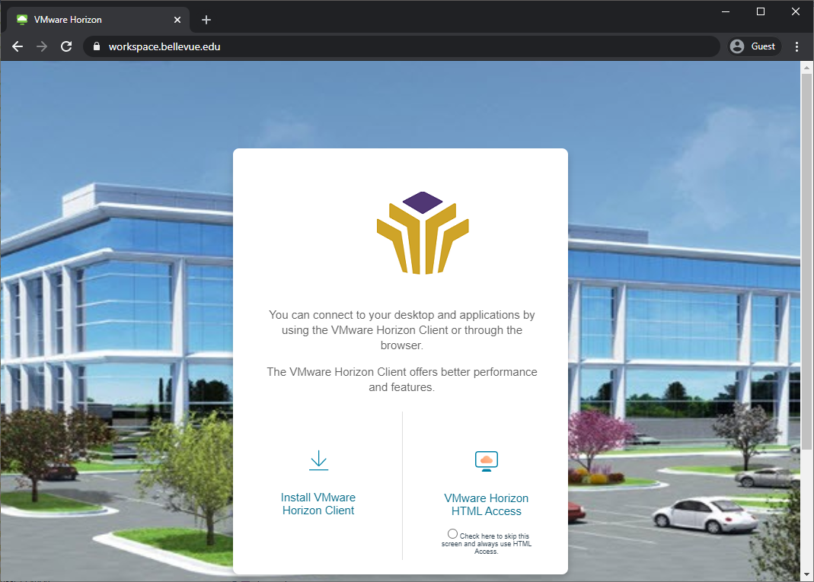
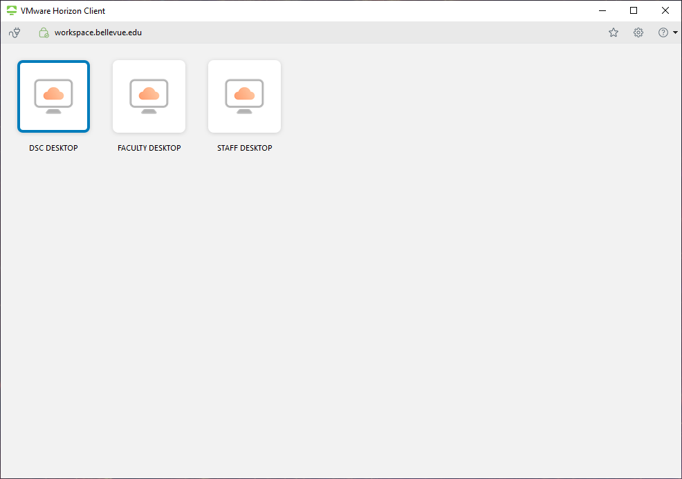
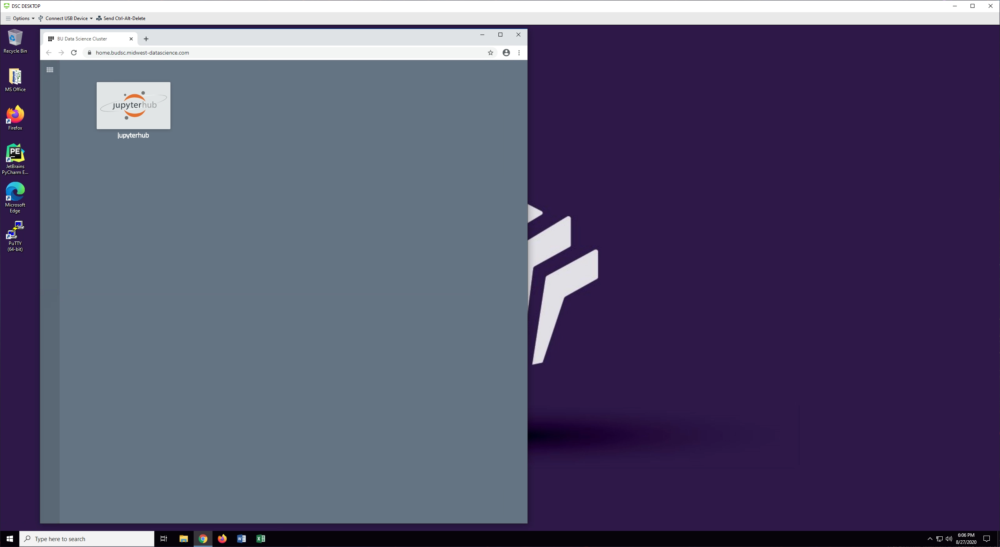
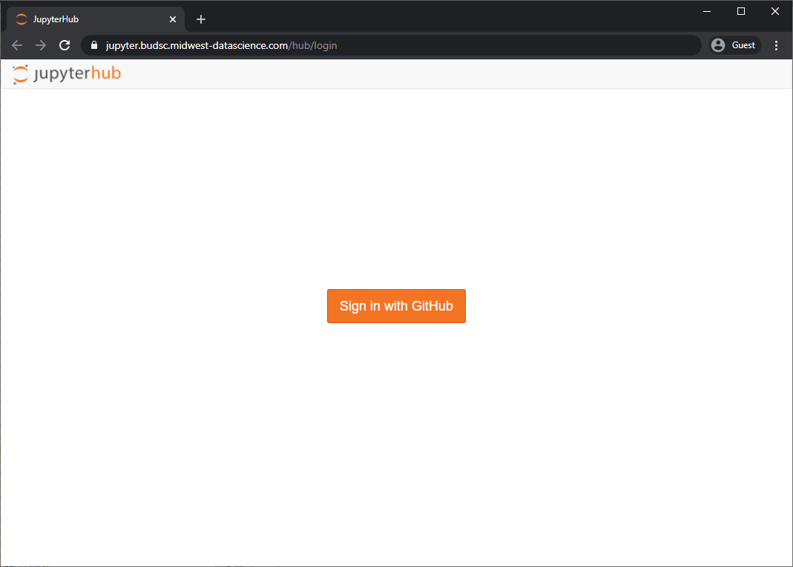
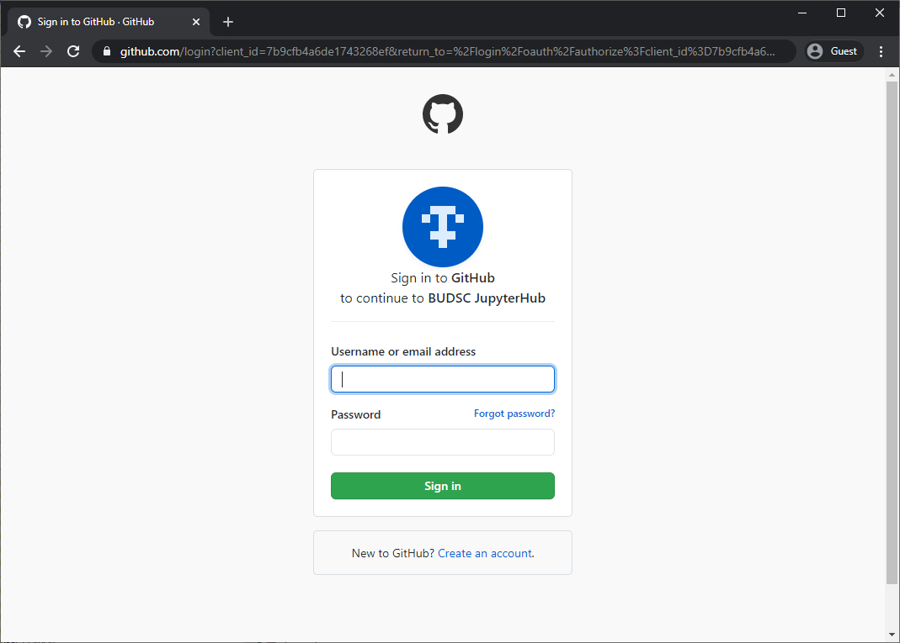
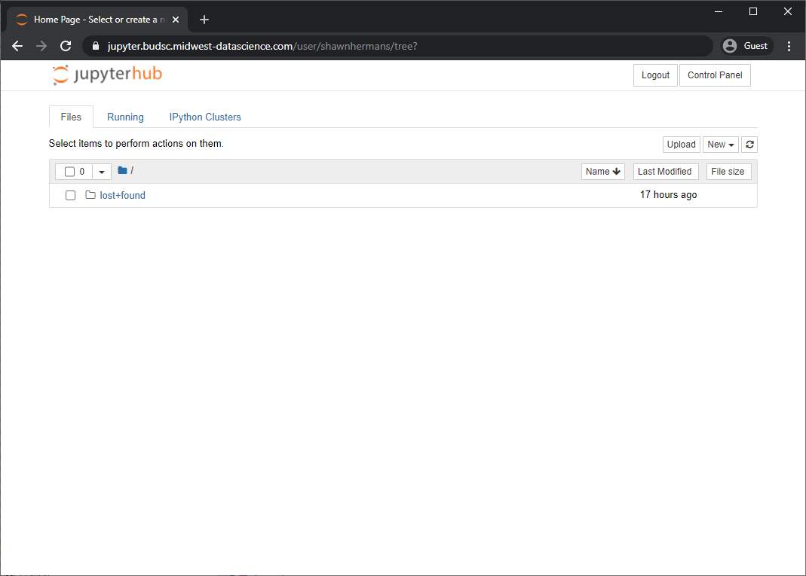

# Hosted Environments

## Bellevue University Data Science Cluster

 Bellevue University hosts a [JupyterHub](https://jupyter.org/hub) instance that includes TensorFlow, PySpark, R, and other data science libraries. To access JupyterHub, start by going to https://workspace.bellevue.edu/. Download and install the VMware Horizon Client.  Login to the client using your Bellevue University username and password.

 Once you log in, you should see multiple desktops which should include the *DSC Desktop*. Select the *DSC Desktop* option which should take you to a Windows virtual machine that is pre-configured to use the JupyterHub instance. 

 Within the *DSC Desktop* instance, open either Firefox or Chrome.  If the homepage doesn't automatically take you to the Bellevue Data Science Cluster homepage, you can manually navigate to it at http://home.budsc.midwest-datascience.com/. 

 This homepage is the landing page for Data Science Cluster applications. Currently, JupyterHub is the only capability available to students, but more capabilities will be available in the future. To access [JupyterHub instance](https://jupyter.budsc.midwest-datascience.com/), click on the JupyterHub logo

 You will be asked to log in using your Github account. You can use whatever Github account you would like. 

 Once you log in, you should be taken to a JupyterHub notebook.  This notebook is backed by persistent storage with 50GB. 

## Google Colaboratory

[Colaboratory](google-colab), or "Colab" for short, provides hosted Jupyter notebooks with free access to GPUs and Tensorflow. 

## Databricks Community Edition

[Databricks Community Edition](databricks-community) provides free access to notebooks configured with PySpark. 

[databricks-community]: https://community.cloud.databricks.com/
[google-colab]: https://colab.research.google.com/